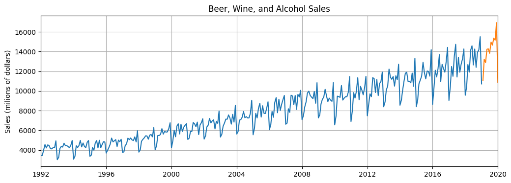

## Project1: Stock Sale Prediction Using Lstm
- Predict Alchohol Sales Time Series Data using LSTM Model in PyTorch.

## Project2: Time Sequence Prediction Using LSTM
- Two LSTMCell units are used in this example to learn some sine wave signals starting at different phases. After learning the sine waves, the network tries to predict the signal values in the future. The results is shown in the picture below.
#### Result
- The initial signal and the predicted results are shown in the image. We first give some initial signals (full line). The network will  subsequently give some predicted results (dash line). It can be concluded that the network can generate new sine waves.
